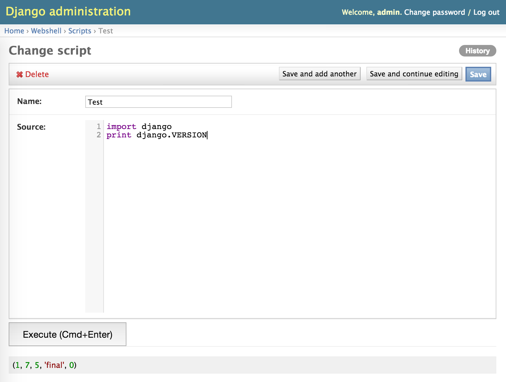

Django-webshell
===============
[](https://travis-ci.org/onrik/django-webshell)
[](https://coveralls.io/github/onrik/django-webshell?branch=master)

Django application for running python code in your project's environment from django admin.

Installation
------------

    pip install django-webshell

settings.py:
```python
INSTALLED_APPS = (
    ...
    'webshell',
    ...
)
```

urls.py:
```python
urlpatterns = patterns('',
    ...
    (r'^admin/webshell/', include('webshell.urls')),
    ...
)
```

